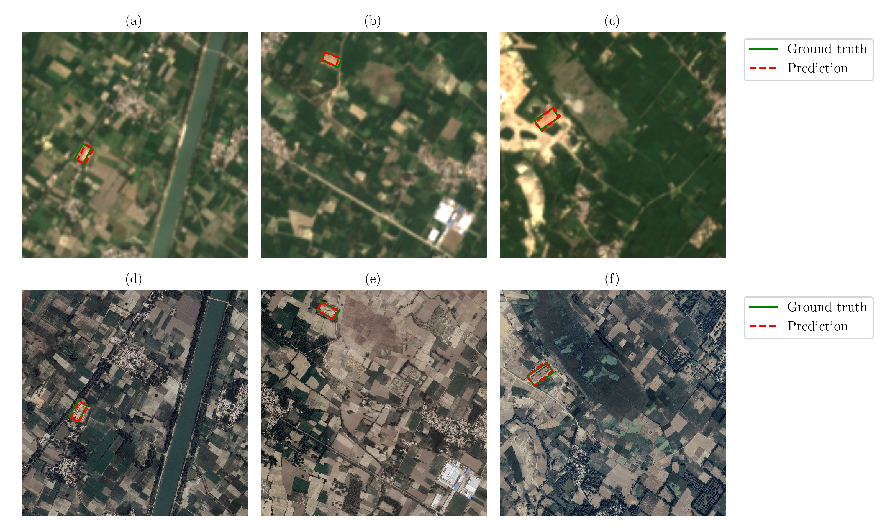

## Samples of best model prediction for Google and Sentinel-2 imagery

* For Sentinel-2, original resolution is 128x128 pixels. We show 640x640 resized (with bilinear interpolation) image here which was used for training and evaluation.
* In the first image we show the full snapshots of the images. Our objects of interest are not clearly visible in full snapshot so we show a zoomed in version in the second image.
* (a, b and c) results are on Sentinel-2 imagery
* (d, e and f) results are on corresponding Google imagery

### Full snapshot version

### Zoomed-in version

