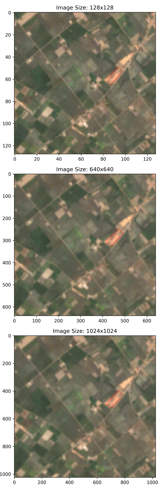
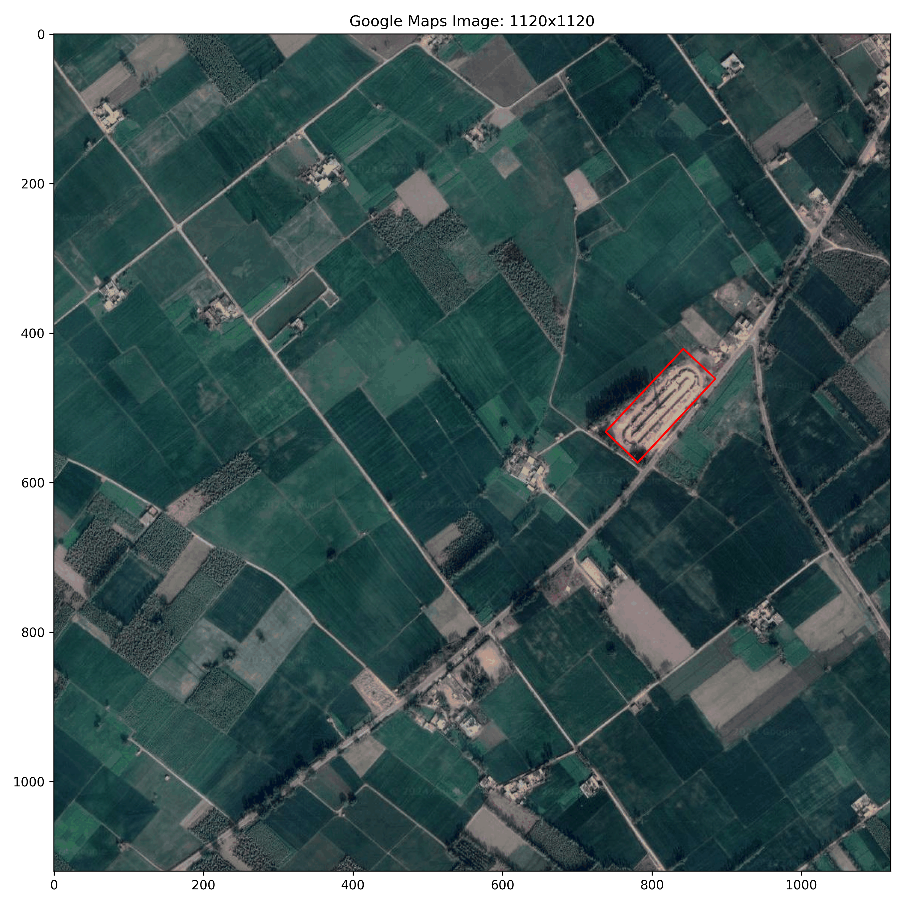
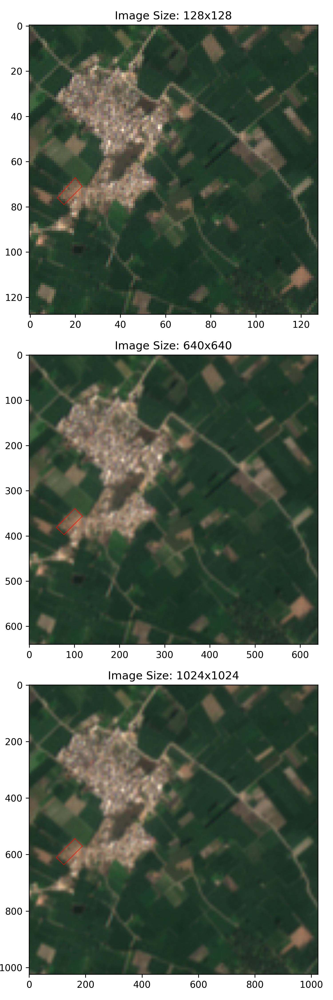
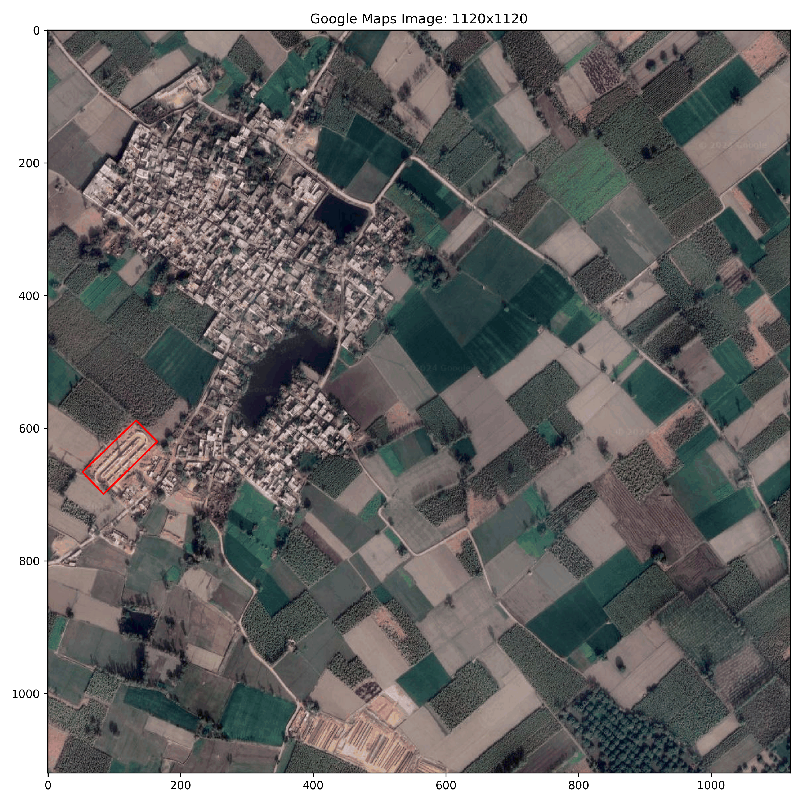
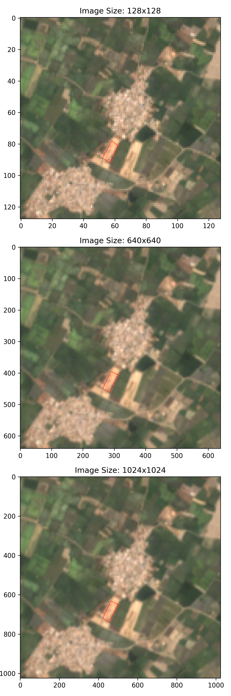
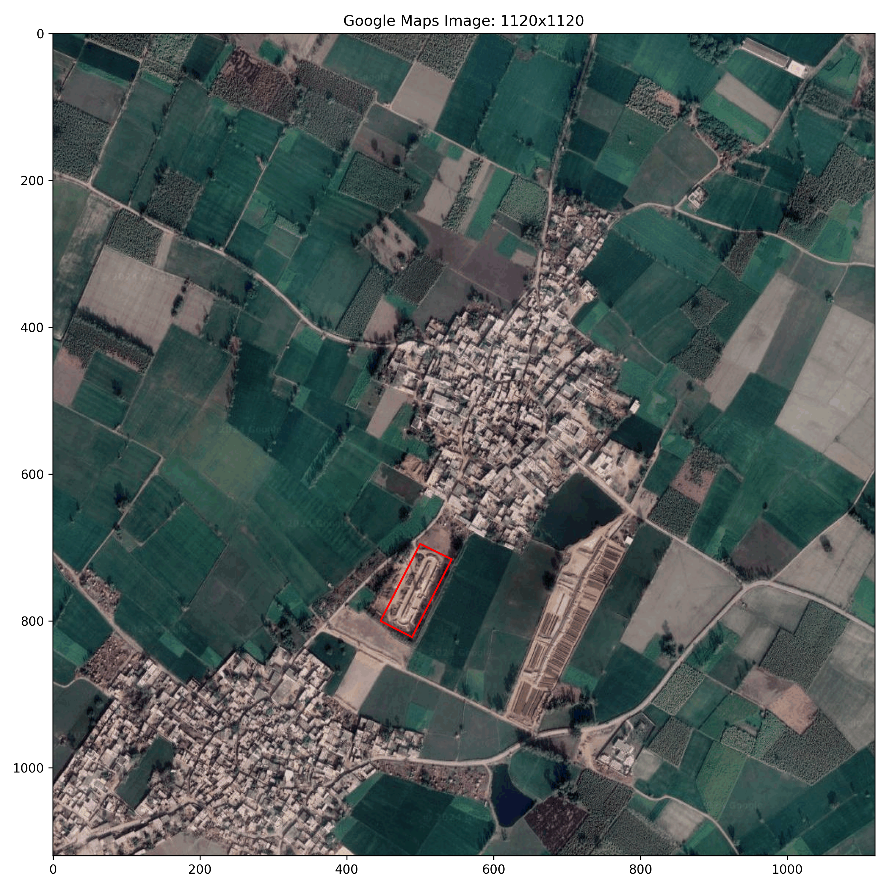

# Sample images

* 128x128 sized Sentinel-2 image shows the original resolution of Sentinel-2 imagery. 640x640 and 1024x1024 versions are interpolated with bilinear interpolation.
* 1120x1120 sized Google image shows the original resolution of Google imagery.
* Bounding box (in red color) shown on the Google image is as it was labeled by us.
* Bounding box (in red color) shown on Sentinel image was transferred with Pixel -> Geo -> UTM method.

## Sample 1 (near lat: 29.64, lon: 77.17)

### Sentinel label 

### Google label

## Sample 2 (near lat: 29.73, lon: 77.18)

### Sentinel label 

### Google label

## Sample 3 (near lat: 29.71, lon: 77.18)

### Sentinel label 

### Google label
